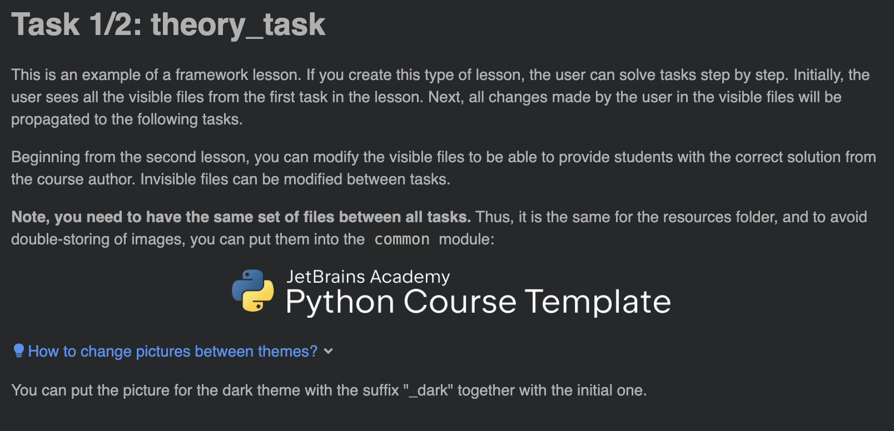

This is an example of a framework lesson. 
If you create this type of lesson, the user can solve tasks step by step.
Initially, the user sees all the visible files from the first task in the lesson.
Next, all changes made by the user in the visible files 
will be propagated to the following tasks.

Beginning from the second lesson, you can modify the visible files to be able to provide 
students with the correct solution from the course author. 
Invisible files can be modified between tasks.

**Note, you need to have the same set of files between all tasks.** 
Thus, it is the same for the resources folder, and to avoid double-storing of images, 
you can put them into the `common` module:

    

You can put the picture for the dark theme with the suffix "_dark" together with the initial one.
In such a case, the plugin will use this picture if the user switched the IDE theme to the dark one:

