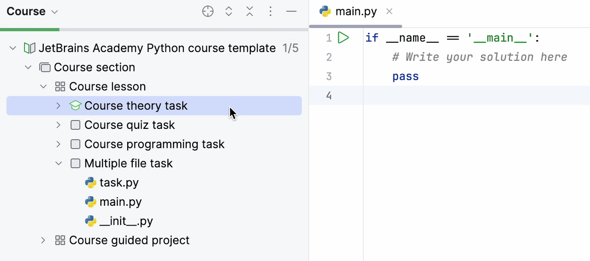

This is an example of an input/output task. 
In this type of task, you can give an expected input and output to the program instead of implementing 
your own tests.

This task also demonstrates how you can set up which file should be opened in the student mode if the task has several files.
You just need to put this file as the first file in the `task-info.yaml` config, e.g. in this task the `task.py` will be opened: 

